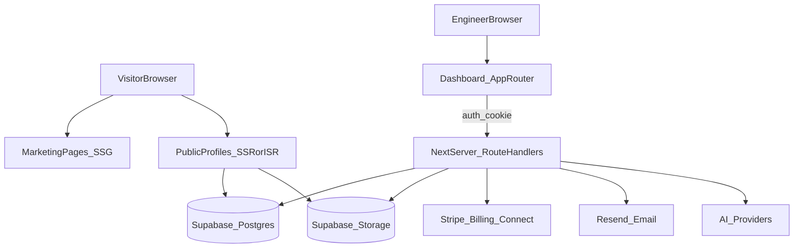
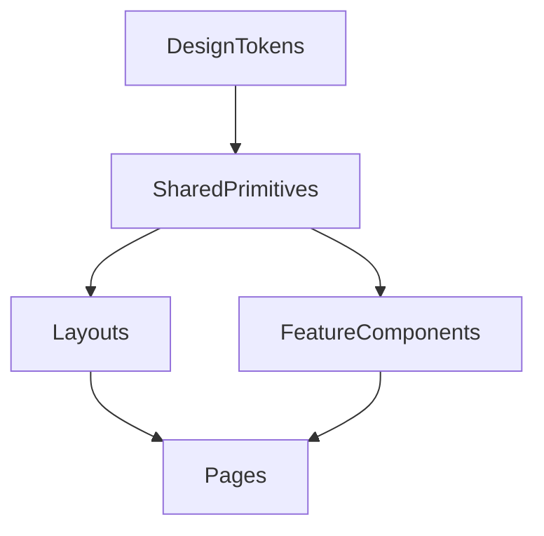

# MixExperts — Master Implementation Plan (Next.js + Supabase + Vercel)

**Version:** 0.1 (generated)  
**Date:** 2025-12-26  
**Source of truth inputs:** the `.md` specs in repo root + the current `mixexperts-5/` UI as the visual anchor.

---

## 1) Executive summary

### 1.1 What we’re building
MixExperts is a **full-stack platform** for audio engineers to publish premium public profiles and run their business: portfolio (with A/B before/after player), services, booking, payments, inquiries/inbox, digital products, analytics, and AI assistance.

### 1.2 Why Next.js (still React)
We are targeting **Next.js 14+ App Router** because MixExperts depends on:
- **SEO + shareability** for marketing pages and public profiles (`/[username]`) with correct metadata + OG cards.
- **Hybrid rendering** (SSR/SSG/ISR) for performance and discoverability.
- **Secure server routes** for Stripe webhooks, AI calls, and other secret-dependent operations (no secrets in browser).

### 1.3 Backend approach
**Supabase** provides:
- Auth (email/password + email verification)
- Postgres DB + RLS
- Storage (avatars, banners, audio, product files)
- Realtime (optional; useful for inbox/live updates)

### 1.4 Design anchor + “world-class” design requirement
The **visual and UX anchor** is the existing `mixexperts-5/` implementation:
- Dark, premium base with subtle grain/noise
- Accent color theming (Amber default + 5 alternates)
- Glass navigation, soft glows, cinematic gradients, bold type

Everything we design and implement must expand from that aesthetic into a cohesive system across the full platform.

### 1.5 Primary docs this plan implements
- Product blueprint: `MIXEXPERTS_MASTER_PLATFORM_BLUEPRINT (1).md`
- Page-by-page UI spec: `MIXEXPERTS_DETAILED_DESIGN_SPECIFICATION (1).md`
- Technical spec: `MIXEXPERTS_IMPLEMENTATION_DETAILS.md`
- Copy: `MIXEXPERTS_CONTENT_COPY_BIBLE.md`
- AI prompts: `MIXEXPERTS_AI_PROMPTS_LIBRARY.md`

---

## 2) System architecture (high-level)

### 2.1 Topology



### 2.2 Rendering strategy (default)
- **Marketing pages** (`/`, `/pricing`, `/features`, `/examples`): **SSG** (fast, cacheable).
- **Public profiles** (`/[username]`, `/[username]/products`, `/[username]/book`): **SSR or ISR** (SEO + per-profile freshness).
- **Auth + Dashboard**: mostly **client components** inside App Router layouts (fast interaction; protected by middleware + RLS).

### 2.3 “Server-only” responsibilities (route handlers)
Anything that must not run in the browser:
- Stripe Billing/Connect session creation
- Stripe webhooks
- AI requests (Anthropic/OpenAI)
- Email sending (Resend) when not covered by Supabase Auth templates
- Optional: abuse protection (rate limiting, captcha verification)

---

## 3) Route map + page inventory (full platform)

> Note: The blueprint lists the core pages. To support a 90+ page product, we explicitly break major dashboard areas into **subroutes** (edit/new/detail views) rather than hiding everything behind modals. This improves navigability, shareability (deep links), and implementation clarity.

### 3.0 Page spec template (applies to every page below)
For each route, we document:
- **Purpose**
- **Primary users**
- **Entry points** (how you get here)
- **Exit points** (where you go next)
- **Key components** (UI building blocks)
- **Data requirements** (tables/queries)
- **Mutations** (writes)
- **Interactions/states** (loading/empty/error/success)
- **Dependencies** (what must exist first)
- **Rendering** (SSG/SSR/ISR/Client)

### 3.1 Route groups (Next.js App Router)
Recommended `app/` structure:
- `app/(marketing)/...` public marketing pages
- `app/(auth)/...` auth + onboarding pages
- `app/(public)/[username]/...` public engineer pages
- `app/(dashboard)/dashboard/...` authenticated app
- `app/api/...` route handlers (Stripe, AI, webhooks, etc.)

### 3.2 Public marketing pages (SSG)

#### `/`
- **Purpose**: Convert visitors to signups; demonstrate value (profile, A/B player, booking, AI, products).
- **Key components**: Marketing `Nav`, `Hero`, `FeaturesGrid`, `BeforeAfterDemo`, `AIShowcase`, `TestimonialsCarousel`, `PricingPreview`, `FinalCTA`, `Footer`.
- **Data**: Mostly static; optional “live counters” from analytics.
- **Interactions**: scroll-trigger animations, demo player.
- **Dependencies**: design tokens, marketing layout, base components.
- **Design notes**: match dark premium aesthetic; “wow” moments via subtle motion and the A/B demo.

#### `/pricing`
- **Purpose**: Explain tiers; convert to signup/upgrade.
- **Key components**: tier cards, comparison table, FAQ, CTA.
- **Data**: Stripe price IDs (server), feature flags.
- **Interactions**: monthly/yearly toggle; highlight recommended tier.

#### `/features`
- **Purpose**: Deep-dive feature marketing; show before/after player, booking, inbox, AI.
- **Data**: static.

#### `/examples`
- **Purpose**: Showcase example engineer profiles; inspiration; conversion.
- **Data**: static seed examples or DB-backed “featured profiles”.

#### `/blog` (future)
- **Purpose**: SEO content marketing.
- **Data**: CMS or MDX.

#### `/legal/terms`, `/legal/privacy`, `/legal/cookies`
- **Purpose**: compliance and trust.
- **Data**: static content from copy bible.

### 3.3 Public engineer pages (SSR/ISR)

#### `/[username]`
- **Purpose**: The engineer’s public portfolio/profile.
- **Key components**: public profile layout, hero, about, portfolio A/B player, services, credits, testimonials, products preview, FAQ, contact/inquiry.
- **Data**: `profiles`, `portfolio_items`, `services`, `credits`, `testimonials`, `products`, `ai_settings` (chatbot enabled), theme selection.
- **Interactions**: A/B playback with crossfade; inquiry form; chatbot widget; deep links to booking/products.
- **Dependencies**: theme system; storage URLs; audio streaming; inquiry submission.
- **Design notes**: this page must inherit the `mixexperts-5/` “premium profile” feel; treat it as flagship.

#### `/[username]/products`
- **Purpose**: Public storefront for that engineer.
- **Data**: engineer profile + products + previews.
- **Interactions**: buy flow (Stripe Checkout), filters, preview playback.

#### `/[username]/book`
- **Purpose**: Direct booking page for that engineer/service.
- **Data**: services, availability, booking rules, timezone.
- **Interactions**: select service/time; deposit payment; confirmation.

### 3.4 Auth + onboarding (App Router)

#### `/login`
- **Purpose**: Sign in.
- **Data**: Supabase Auth.
- **Interactions**: email/password; errors; loading.
- **Design notes**: centered card; subtle gradient background; match spec.

#### `/signup`
- **Purpose**: Create account; multi-step onboarding (3 steps per design spec).
- **Steps**: account creation → profile basics → finish setup.
- **Data**: Supabase Auth + create `profiles` row.
- **Interactions**: username availability check; stepper; ToS checkbox.

#### `/forgot-password`
- **Purpose**: request reset email.

#### `/reset-password`
- **Purpose**: set new password.

#### `/verify-email`
- **Purpose**: confirm email verification and route to onboarding/dashboard.

#### `/onboarding` (optional dedicated wizard route)
- **Purpose**: post-signup completion; can be merged into `/signup` steps.

### 3.5 Dashboard (auth required)

#### `/dashboard`
- **Purpose**: overview (stats, quick actions, AI suggestions, completeness).
- **Data**: analytics aggregates; profile completeness; recent inquiries/bookings.

#### Profile area (tabs become routes)
- `/dashboard/profile` (basic info)
- `/dashboard/profile/portfolio`
- `/dashboard/profile/credits`
- `/dashboard/profile/testimonials`
- `/dashboard/profile/faq`

For each:
- **Purpose**: edit corresponding public profile sections.
- **Data**: `profiles`, `portfolio_items`, `credits`, `testimonials`, `faqs` (may be JSON on profile).
- **Interactions**: upload avatar/banner; reorder items; add/edit/delete; publish toggles; theme selection.

#### Business area
- `/dashboard/business/services`
- `/dashboard/business/services/new`
- `/dashboard/business/services/[serviceId]`
- `/dashboard/business/products`
- `/dashboard/business/products/new`
- `/dashboard/business/products/[productId]`
- `/dashboard/business/calendar`
- `/dashboard/business/bookings`
- `/dashboard/business/bookings/[bookingId]`

#### Inbox
- `/dashboard/inbox`
- `/dashboard/inbox/[inquiryId]`

#### AI
- `/dashboard/ai`
- `/dashboard/ai/chatbot` (settings + training)

#### Analytics
- `/dashboard/analytics`
- `/dashboard/analytics/traffic`
- `/dashboard/analytics/conversions`
- `/dashboard/analytics/revenue`

#### Settings
- `/dashboard/settings/account`
- `/dashboard/settings/billing`
- `/dashboard/settings/integrations`
- `/dashboard/settings/ai`
- `/dashboard/settings/domain`

> Each dashboard page follows the shared layout spec: sidebar on desktop; header + bottom nav on mobile.

### 3.6 Admin (optional, but planned)
- `/admin`
- `/admin/users`
- `/admin/profiles`
- `/admin/revenue`
- `/admin/support`
- `/admin/feature-flags`

---

## 4) Component architecture + dependency tree

### 4.1 Design token source (port from `mixexperts-5/`)
The existing `mixexperts-5/index.html` defines core CSS variables:
- `--bg-base`, `--bg-elevated`, `--bg-card`, `--bg-hover`
- `--text-white`, `--text-gray`, `--text-muted`, `--text-faint`
- `--border-dark`
- theme accents: `--accent`, `--accent-light`, `--accent-subtle`, `--accent-glow`

We will formalize these into:
- `styles/tokens.css` (CSS variables)
- `lib/themes.ts` (theme palette map)
- `tailwind.config.ts` (utilities mapping to CSS vars)

### 4.2 Shared primitives (examples)
Core shared UI components (names illustrative):
- `Button` (primary/secondary/ghost + loading + icon)
- `Input`, `Textarea`, `Select`, `Checkbox`, `RadioGroup`, `Switch`
- `Card` (default/elevated/glass)
- `Modal`/`Dialog`
- `Tabs`
- `Toast` + `InlineAlert`
- `Skeleton` loaders
- `Avatar`
- `FileDropzone` (drag/drop)
- `DataTable` (sorting/filtering/pagination)

### 4.3 Feature components
- `BeforeAfterPlayer` (crossfade; waveform; playlist)
- `Waveform` (peaks data; responsive)
- `InquiryForm` + `InquiryThread`
- `BookingCalendar` + `TimeslotPicker`
- `ProductCard` + `CheckoutButton`
- `AiChatPanel` + `AiQuickActions`

### 4.4 Layout shells
- `MarketingLayout`
- `AuthLayout`
- `DashboardLayout` (sidebar/header/bottom-nav responsive)
- `PublicProfileLayout`

### 4.5 Dependency tree (coarse)



---

## 5) Data architecture (Supabase-first)

### 5.1 Core tables (minimum viable set)
From the blueprint and implementation details:
- `profiles`
- `portfolio_items`
- `services`
- `products`
- `credits`
- `testimonials`
- `inquiries`
- `inquiry_messages`
- `bookings`
- `subscriptions`
- `ai_settings`
- `analytics_events`

### 5.2 RLS policy intent (high-level)
- **Public read**: published profiles and their public content.
- **Owner read/write**: a user can manage their own profile + related tables.
- **Admin**: optional admin override via custom claim/role.

### 5.3 Storage buckets
From `MIXEXPERTS_IMPLEMENTATION_DETAILS.md`:
- `avatars` (public)
- `banners` (public)
- `portfolio-audio` (public or signed; depends on tier/privacy)
- `portfolio-images` (public)
- `products` (private; signed download after purchase)
- `product-previews` (public)
- `credit-logos` (public)

### 5.4 Data model contracts (TypeScript, canonical)
These types are used across API + UI. (Names illustrative; align with actual schema.)

```ts
export type ThemeName = 'amber' | 'teal' | 'sage' | 'slate' | 'rose' | 'violet';

export interface Profile {
  id: string; // auth.users.id
  username: string;
  display_name: string;
  tagline?: string | null;
  bio?: string | null;
  avatar_url?: string | null;
  banner_url?: string | null;
  location?: string | null;
  timezone: string;
  theme: ThemeName;
  is_published: boolean;
  is_verified: boolean;
  custom_domain?: string | null;
  social_links?: Record<string, string> | null;
  seo_title?: string | null;
  seo_description?: string | null;
  created_at: string;
  updated_at: string;
}
```

---

## 6) API / server routes (Next.js route handlers)

### 6.1 Stripe
- `POST /api/stripe/checkout` create checkout session (subscriptions or product purchase)
- `POST /api/webhooks/stripe` handle Stripe events (billing, connect payouts, product purchase fulfillment)
- `POST /api/stripe/customer-portal` billing portal

### 6.2 AI
- `POST /api/ai/generate` (bio/tagline/service copy/response drafts/optimization)
- `POST /api/ai/chat` (chatbot for profile widget + dashboard assistant)

### 6.3 Email
- `POST /api/email/send` (optional) for inquiry notifications, booking confirmations if not handled elsewhere

### 6.4 Public data (optional)
Prefer server components reading directly from Supabase with RLS; only add public APIs when necessary.

---

## 7) Technical architecture decisions (implementation-ready)

### 7.1 State management
- **Server state**: prefer React Server Components + `fetch`/Supabase server client; use client fetching only where needed.
- **Client state**: minimal; local UI state + `zustand` for cross-component UI state (modals, toasts, editor panels).
- **Forms**: `react-hook-form` + `zod` schemas (mirrors validation rules in `MIXEXPERTS_IMPLEMENTATION_DETAILS.md`).

### 7.2 File uploads (Supabase Storage)
- Use **direct-to-storage uploads** from the browser (signed upload URL if private).
- Validate type/size client-side + enforce server-side via bucket limits.
- Store URLs/paths in DB tables; render via public URL or signed URL.
- Audio constraints: MP3/WAV/FLAC, max 50MB (per spec).

### 7.3 Authentication + route protection
- Supabase Auth with email verification.
- Next middleware to protect `/dashboard/**` and redirect to `/login`.
- Use RLS as the true enforcement layer; UI checks are convenience only.

### 7.4 SEO + metadata
- Marketing pages: SSG + static metadata.
- Public profiles: SSR/ISR with per-profile metadata (title, description, OG image).
- Generate OG images (optional) via route handler to improve shareability.

### 7.5 Observability + analytics
- Capture key events into `analytics_events` and/or PostHog.
- Log server errors (Vercel logs) with correlation IDs per request.

---

## 7) Implementation sequence (phased)

This follows the blueprint phases, adapted to Next.js.

### Phase 1 — Foundation (Weeks 1–3)
- Next.js App Router project scaffold
- Tokens/theme system ported from `mixexperts-5/`
- Supabase Auth + session middleware
- Core DB schema + RLS baseline
- Storage buckets + upload utilities
- Shared component library (primitives)

### Phase 2 — Core engineer experience (Weeks 4–7)
- Dashboard layout + navigation
- Profile editor (basic info + portfolio)
- Upload flows (images + audio)
- Services manager
- Inbox MVP (inquiries + messages)

### Phase 3 — Public profile & discovery (Weeks 8–10)
- Public profile rendering with theme
- Before/after player (flagship)
- Contact/inquiry submission + notifications
- Marketing pages implemented to spec

### Phase 4 — Monetization & booking (Weeks 11–14)
- Stripe Billing (tiers) + subscription gating
- Stripe Connect (payouts)
- Booking calendar + deposits
- Digital products purchase + fulfillment

### Phase 5 — AI & polish (Weeks 15–18)
- AI assistant dashboard
- Profile chatbot widget
- Analytics dashboard
- Performance + accessibility + launch readiness

---

## 8) Risk assessment (high-level)
- **Stripe Connect + compliance**: highest risk; start early with test mode.
- **Audio uploads + playback**: ensure streaming + mobile performance; limit sizes.
- **Timezone/booking correctness**: strict timezone handling; exhaustive tests.
- **AI output quality/safety**: guardrails; avoid fabricated claims; require approvals.

---

## 9) Success criteria (definition of done)
- Public profiles are **fast, indexable, and beautiful**, matching the premium anchor.
- Engineers can fully manage profile + portfolio + services + inquiries.
- Payments/subscriptions function end-to-end in test mode (webhooks verified).
- Uploads and A/B audio playback are reliable on mobile.
- Core flows are accessible (keyboard, contrast) and resilient (errors, empty states).


